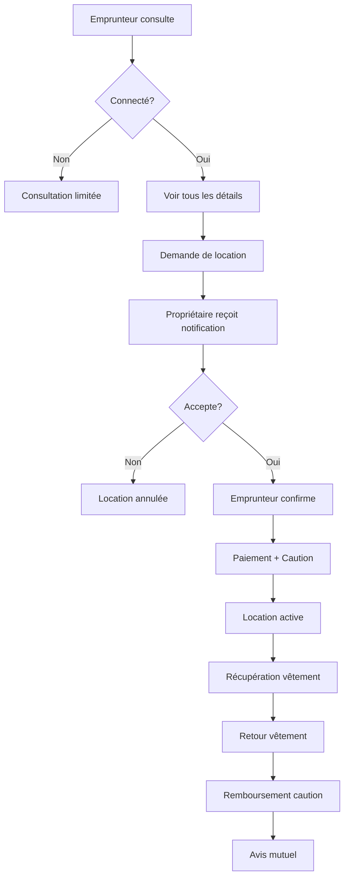

# SuitForU - Plateforme de Location de Vêtements de Cérémonie

## 🎯 Vue d'ensemble

SuitForU est une plateforme complète permettant aux particuliers de louer leurs vestes de mariage et vêtements de cérémonie. Le projet comprend:

- **API Backend** (.NET 9 / C#)
- **Application Mobile** (Flutter)
- **Site Web** (Angular 18)

## 📁 Structure du Projet

```
suitforu/
├── backend/
│   ├── src/
│   │   ├── SuitForU.Domain/          # Entités, Enums, Interfaces
│   │   ├── SuitForU.Application/     # DTOs, Services, Validators
│   │   ├── SuitForU.Infrastructure/  # DbContext, Repositories, Services externes
│   │   └── SuitForU.API/             # Controllers, Middleware, Configuration
│   └── tests/
│       ├── SuitForU.Application.Tests/
│       ├── SuitForU.Infrastructure.Tests/
│       └── SuitForU.API.Tests/
├── mobile/                           # Application Flutter
│   ├── lib/
│   │   ├── core/                    # Configuration, Constants, Utils
│   │   ├── features/                # Features avec architecture BLoC
│   │   │   ├── auth/
│   │   │   ├── garments/
│   │   │   ├── rentals/
│   │   │   └── profile/
│   │   └── shared/                  # Widgets partagés
│   └── test/
└── web/                             # Application Angular
    ├── src/
    │   ├── app/
    │   │   ├── core/               # Services globaux, Guards, Interceptors
    │   │   ├── features/           # Modules par fonctionnalité
    │   │   │   ├── auth/
    │   │   │   ├── garments/
    │   │   │   ├── rentals/
    │   │   │   └── profile/
    │   │   └── shared/            # Composants partagés
    │   └── assets/
    └── tests/
```

## 🏗️ Architecture Backend - Clean Architecture

### Domain Layer (SuitForU.Domain)
**Responsabilité**: Logique métier pure, indépendante de toute technologie

**Contenu**:
- **Entities**: User, Garment, GarmentImage, Rental, Payment, Review, RefreshToken, Conversation, Message, GarmentAvailability
- **Enums**: AuthProvider, GarmentType, GarmentCondition, RentalStatus, PaymentStatus, PaymentType, PaymentMethod, AvailabilityBlockReason
- **Interfaces**: IRepository, IUnitOfWork, repositories spécifiques

**Principe**: Aucune dépendance externe, code métier pur

### Application Layer (SuitForU.Application)
**Responsabilité**: Orchestration de la logique métier

**Contenu**:
- **DTOs**: Objets de transfert de données pour l'API
- **Interfaces**: IAuthService, IGarmentService, IRentalService, IPaymentService
- **Validators**: Validation avec FluentValidation
- **Mappings**: AutoMapper profiles

**Dépendances**: Domain uniquement

### Infrastructure Layer (SuitForU.Infrastructure)
**Responsabilité**: Implémentation technique et accès aux données

**Contenu**:
- **Persistence**: ApplicationDbContext, configurations EF Core
- **Repositories**: Implémentations des interfaces du Domain
- **Services externes**: JWT, Storage, Email, Payment (Stripe)

**Dépendances**: Domain, Application

### API Layer (SuitForU.API)
**Responsabilité**: Point d'entrée HTTP, controllers REST

**Contenu**:
- **Controllers**: AuthController, GarmentsController, RentalsController
- **Middleware**: Exception handling, logging
- **Configuration**: Swagger, CORS, Authentication

**Dépendances**: Application, Infrastructure

## 📊 Modèle de Données

### User (Utilisateur)
```
- Id (Guid)
- Email, PasswordHash
- FirstName, LastName
- PhoneNumber
- ProfilePictureUrl
- AuthProvider (Local, Google, Facebook, Instagram)
- EmailConfirmed, PhoneNumberConfirmed
```

### Garment (Vêtement)
```
- Id (Guid)
- OwnerId (Guid)
- Title, Description
- Type (Suit, Jacket, Tuxedo, etc.)
- Condition (LikeNew, WornOnce, Good, MinorImperfections)
- Size, Brand, Color
- DailyPrice, DepositAmount
- PickupAddress, City, PostalCode, Country
- Latitude, Longitude
- IsAvailable
- Images (Collection)
```

### Rental (Location)
```
- Id (Guid)
- GarmentId, RenterId, OwnerId
- StartDate, EndDate, DurationDays
- DailyPrice, TotalPrice, DepositAmount
- Status (Pending, OwnerAccepted, Confirmed, Active, Completed, Cancelled)
- OwnerAcceptedAt, RenterConfirmedAt
- PickupConfirmedAt, ReturnConfirmedAt
```

### Payment (Paiement)
```
- Id (Guid)
- RentalId, UserId
- Type (Rental, Deposit, DepositRefund, Extension)
- Method (CreditCard, Visa, MasterCard, AmEx, PayPal)
- Amount
- Status (Pending, Processing, Succeeded, Failed, Refunded)
- TransactionId, PaymentIntentId
```

### Review (Avis)
```
- Id (Guid)
- RentalId, ReviewerId, ReviewedUserId, GarmentId
- Rating (1-5)
- Comment
```

## 🔐 Authentification & Autorisation

### Méthodes d'authentification
1. **Local**: Email + Password (hash BCrypt)
2. **OAuth 2.0**: Google, Facebook, Instagram

### JWT Tokens
- **Access Token**: 1 heure
- **Refresh Token**: 7 jours
- Claims: UserId, Email, Roles

## 💳 Système de Paiement

### Intégration Stripe
1. **Location**: Paiement du prix journalier × durée
2. **Caution**: Blocage du montant de dépôt
3. **Remboursement**: Libération de la caution après retour
4. **Extension**: Paiement supplémentaire pour prolongation

### Méthodes acceptées
- Cartes bancaires (Visa, MasterCard, American Express)
- PayPal

## 🔄 Workflow de Location



## 🚀 Technologies Utilisées

### Backend (.NET 9)
- **Framework**: ASP.NET Core Web API
- **ORM**: Entity Framework Core 9.0
- **Database**: SQL Server
- **Auth**: JWT Bearer + OAuth 2.0
- **Validation**: FluentValidation
- **Mapping**: AutoMapper
- **Tests**: xUnit, Moq
- **Documentation**: Swagger/OpenAPI

### Mobile (Flutter)
- **Framework**: Flutter (latest stable)
- **Architecture**: BLoC Pattern + Clean Architecture
- **State Management**: flutter_bloc
- **Networking**: dio, http
- **Storage**: shared_preferences, hive
- **Auth**: flutter_secure_storage
- **Images**: image_picker, cached_network_image
- **Payment**: stripe_flutter
- **Maps**: google_maps_flutter
- **i18n**: flutter_localizations
- **Tests**: flutter_test, mocktail

### Web (Angular 18)
- **Framework**: Angular 18
- **UI**: Angular Material
- **State Management**: RxJS + Services
- **Forms**: Reactive Forms
- **HTTP**: HttpClient + Interceptors
- **Auth**: JWT + Guards
- **Maps**: @angular/google-maps
- **Payment**: @stripe/stripe-js
- **i18n**: @ngx-translate/core
- **Tests**: Jasmine, Karma

## 📱 Fonctionnalités

### Pour les Propriétaires (Loueurs)
- ✅ Ajouter un vêtement avec 3 photos
- ✅ Définir le prix journalier et la caution
- ✅ Gérer la disponibilité
- ✅ Recevoir les demandes de location
- ✅ Accepter/Refuser les locations
- ✅ Suivi des locations en cours
- ✅ Historique des locations
- ✅ Gestion des avis reçus

### Pour les Emprunteurs
- ✅ Navigation sans inscription (mode consultation)
- ✅ Recherche par ville, prix, type
- ✅ Filtrage avancé
- ✅ Demande de location
- ✅ Paiement sécurisé
- ✅ Prolongation de location
- ✅ Historique des locations
- ✅ Laisser des avis

### Fonctionnalités Communes
- ✅ Profil utilisateur
- ✅ Messagerie intégrée (entre loueur/emprunteur)
- ✅ Notifications push
- ✅ Géolocalisation
- ✅ Mode sombre/clair
- ✅ Multilingue (FR/EN)

## 🎨 Design System

### Palette de Couleurs
```
Primary: #1A1A2E (Bleu nuit élégant)
Secondary: #C5A572 (Or champagne)
Accent: #E94560 (Rouge élégant)
Background: #FFFFFF / #F5F5F5
Text: #2D2D2D / #FFFFFF (dark mode)
```

### Typographie
- **Headings**: Playfair Display (élégant, sérif)
- **Body**: Inter (moderne, sans-sérif)

### Composants
- Cards avec ombres douces
- Boutons arrondis
- Inputs avec labels flottants
- Images avec overlay gradient
- Animations fluides

## 🔒 Sécurité

- ✅ Authentification JWT
- ✅ Refresh tokens
- ✅ HTTPS uniquement
- ✅ Rate limiting
- ✅ Input validation côté client et serveur
- ✅ Sanitization des données
- ✅ CORS configuré
- ✅ Protection CSRF
- ✅ Paiements via Stripe (PCI compliant)
- ✅ Données sensibles chiffrées

## 📊 Tests

### Backend
- **Unit Tests**: Services, Repositories, Validators
- **Integration Tests**: Controllers, Database
- **Coverage**: >80%

### Mobile
- **Unit Tests**: BLoCs, Repositories, Utils
- **Widget Tests**: UI Components
- **Coverage**: >70%

### Web
- **Unit Tests**: Services, Components
- **E2E Tests**: Critical user flows
- **Coverage**: >75%

## 🚀 Déploiement

### Backend
- **Azure App Service** ou **AWS ECS**
- **Database**: Azure SQL ou AWS RDS
- **Storage**: Azure Blob Storage ou AWS S3
- **CDN**: Azure CDN ou CloudFront

### Mobile
- **iOS**: App Store
- **Android**: Google Play Store
- **CI/CD**: GitHub Actions + Fastlane

### Web
- **Hosting**: Vercel ou Netlify
- **CI/CD**: GitHub Actions

## 📚 Documentation API

L'API est documentée avec Swagger/OpenAPI. Une fois le backend lancé, accédez à:
```
https://localhost:5001/swagger
```

## 🌍 Internationalisation

### Langues supportées
- 🇫🇷 Français (par défaut)
- 🇬🇧 English

### Fichiers de traduction
- Backend: Resources/*.resx
- Mobile: assets/translations/*.json
- Web: assets/i18n/*.json

## 📞 Support & Contact

Pour toute question ou suggestion:
- Email: support@suitforu.com
- GitHub Issues: [suitforu/issues](https://github.com/suitforu/issues)

## 📄 Licence

Ce projet est propriétaire. Tous droits réservés.

---

**Développé avec ❤️ pour rentabiliser vos beaux costumes !**
